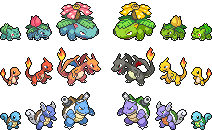
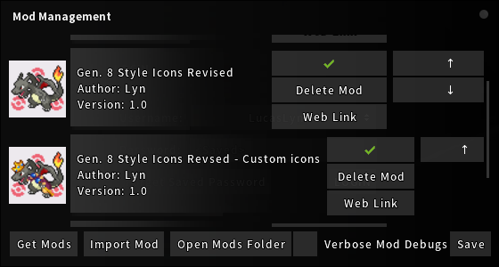

# Gen. 8 SW/SH Style Monster Icons Revised

This is a PokeMMO mod which changes the default monster icons
seen in places like the Pokedex, the Party, and the PC,
to Gen. 8 SW/SH styled icons.

[PokeMMO forums post](https://forums.pokemmo.com/index.php?/topic/199900-gen-8-style-icons-revised/)

[**__Download mod__**]()

[**__Download custom icon mod (add-on)__**]()

[**__Installation instructions__**](#installation)

## Features

- Regular and shiny icons for *every* species in the game
- Gendered icons for every species with gender differences
- Alternate form icons
- Full quality icons (no bad resizing)
- Custom icons for costumed species (WIP)
- Custom icons for more lively animations (WIP)

## Screenshots

## Installation

1. Download the mod (optionally the custom icon mod as well).
2. Place the downloaded `*.zip` file(s) in the mod directory (typically: `.../PokeMMO/data/mods`).
3. Load up the game and enable the mod(s) in the `Mod Management` window, press save and relaunch the game.

> [!IMPORTANT]
> If you downloaded the custom icon add-on mod, ensure the custom mod is ***below***
> the regular mod in the order (use the arrows on the right).
> 
> 

